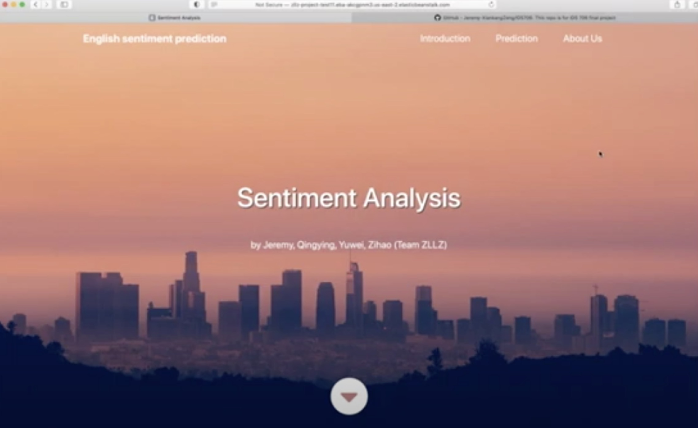

# sentiment-analysis-web-application
This is an web application for sentiment analysis based on AWS. It can get the text input by customers and transfer this text to AWS. After AWS gets the text, it can automatically store the text into the DynamoDB, analyze the sentiment of the text by AWS Comprehend and return the final result to the website, all of which are triggered by the AWS Lambda functions.

Please see our demo her:
[]
